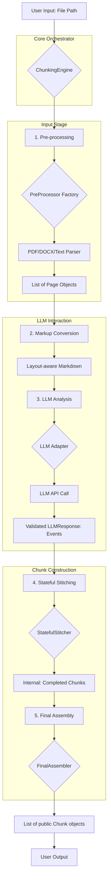

# Staccato: Logical Architecture

This document provides a detailed overview of the Staccato library's internal architecture, data flow, and the role of its core components.

---

## High-Level Data Flow

The primary goal of Staccato is to transform an unstructured document file into a structured, hierarchical list of semantic `Chunk` objects. This is achieved through a sequential pipeline orchestrated by the `ChunkingEngine`.

The diagram below illustrates the end-to-end process:

---

## Component Breakdown

### 1. The `ChunkingEngine` (`staccato.core.engine`)
*   **Role:** The main orchestrator and the primary user-facing entry point.
*   **Process:**
    1.  Receives a file path from the user via `aprocess_document()`.
    2.  Initializes all necessary components: `PreProcessor`, `LLMAdapter`, `StatefulStitcher`, and `FinalAssembler`.
    3.  Manages the overall pipeline, passing data from one component to the next.
    4.  Returns the final, assembled list of `Chunk` objects to the user.

### 2. The `PreProcessor` (`staccato.preprocess`)
*   **Role:** To extract raw content and layout metadata from various document formats.
*   **Process:**
    1.  A factory selects the appropriate parser (e.g., `PdfPlumberPreProcessor`, `DocxPreProcessor`) based on the file extension.
    2.  The selected parser extracts information into a standardized format: a list of `Page` objects.
    3.  Each `Page` contains a list of `Block` objects, where each `Block` holds its text content, bounding box coordinates, and font metadata (size, weight).

### 3. Markup Conversion (`staccato.preprocess.markup`)
*   **Role:** To translate the structured `Page` data into a format the LLM can easily understand.
*   **Process:**
    1.  The `convert_page_to_markdown` utility iterates through the `Block`s on a `Page`.
    2.  It uses heuristics based on font size and weight to convert text into a simplified markdown (e.g., larger text becomes a `# heading`).
    3.  This step preserves critical layout information in a compact, text-based format.

### 4. The `LLMAdapter` (`staccato.llm`)
*   **Role:** To handle all communication with a Large Language Model.
*   **Process:**
    1.  The `ChunkingEngine` passes the generated markdown content to the configured adapter (e.g., `OpenAIAdapter`).
    2.  The adapter formats a request using prompt templates defined in `staccato.internal.prompts`.
    3.  It sends the request to the LLM API and awaits a response.
    4.  Crucially, it validates the received JSON against the `LLMResponse` Pydantic model to ensure it adheres to the expected event structure. If validation fails, it raises an error.

### 5. The `StatefulStitcher` (`staccato.core.stitcher`)
*   **Role:** The state machine at the heart of the chunking logic. It translates the LLM's event stream into concrete chunks.
*   **Process:**
    1.  It receives the list of `Event` objects (`STARTS`, `ENDS`, `CONTINUATION`) from the `LLMAdapter`.
    2.  It maintains a stack of "active chunks."
    3.  **`STARTS` Event:** A new chunk is created and pushed onto the stack. Its content is added.
    4.  **`CONTINUATION` Event:** Content is appended to the chunk currently at the top of the stack.
    5.  **`ENDS` Event:** The chunk at the top of the stack is considered complete. It is popped from the active stack and moved to a list of "completed chunks."
    6.  This stateful, stack-based approach allows it to correctly handle nested structures and elements that span multiple pages.

### 6. The `FinalAssembler` (`staccato.core.assembler`)
*   **Role:** To transform the internal representation of chunks into the clean, public-facing format.
*   **Process:**
    1.  Once all pages have been processed, the `FinalAssembler` takes the list of `CompletedChunk` objects from the `StatefulStitcher`.
    2.  It converts each `CompletedChunk` into a final `Chunk` object (`staccato.models.Chunk`).
    3.  This involves setting up parent-child relationships, populating metadata fields, and ensuring the output is clean and easy for the end-user to work with. 